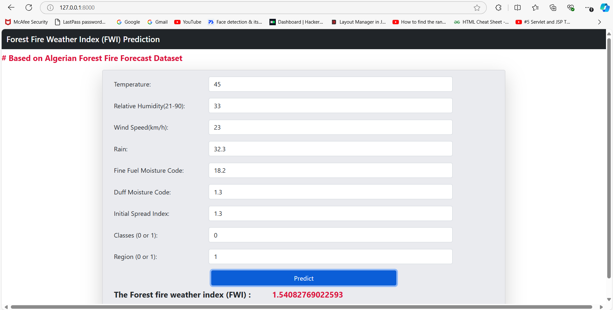

 <h1>Forest Fire Weather Index Prediction</h1>

<h2>Overview</h2>
    
This project focuses on predicting the <strong>Forest Fire Weather Index (FWI)</strong> based on meteorological data derived from the <strong>Algerian Forest Fire Dataset</strong>. The model used for prediction is <strong>Ridge Regression</strong>, which is ideal for handling multicollinearity and producing more generalized models.

<h2>Dataset</h2>
    
The dataset utilized is the <em>Algerian Forest Fire Dataset</em>, which includes the following features:

    <ul>
        <li><strong>Temperature (°C)</strong></li>
        <li><strong>Relative Humidity (%)</strong></li>
        <li><strong>Wind Speed (km/h)</strong></li>
        <li><strong>Rain (mm)</strong></li>
        <li><strong>FFMC (Fine Fuel Moisture Code)</strong></li>
        <li><strong>DMC (Duff Moisture Code)</strong></li>
        <li><strong>DC (Drought Code)</strong></li>
        <li><strong>ISI (Initial Spread Index)</strong></li>
        <li><strong>BUI (Buildup Index)</strong></li>
        <li><strong>FWI (Fire Weather Index - Target variable)</strong></li>
    </ul>

<h2>Model: Ridge Regression</h2>
    
The <strong>Ridge Regression Model</strong> was used in this project due to its ability to handle collinearity among the features. It adds a penalty to the loss function to minimize the complexity of the model and prevent overfitting.

<h3>Model Features:</h3>
    <ul>
        <li>Handles multicollinearity effectively.</li>
        <li>Minimizes overfitting by introducing a regularization term.</li>
        <li>Provides a balance between bias and variance.</li>
    </ul>

    

<h2>Dependencies</h2>
    
The project requires the following libraries:

    <ul>
        <li><strong>Python 3.7+</strong></li>
        <li><strong>NumPy</strong></li>
        <li><strong>Pandas</strong></li>
        <li><strong>Scikit-learn</strong></li>
        <li><strong>Matplotlib</strong> (for visualizations)</li>
         <li><strong>Seaborn</strong> (for visualizations)</li>
    </ul>

<h2>Results</h2>
    
The Ridge Regression model performed with a high level of accuracy when predicting the <strong>Fire Weather Index (FWI)</strong>. It effectively balanced bias and variance, resulting in reliable predictions.

    
Key Metrics:

    <ul>
        <li><strong>Mean Absolute Error (MAE):</strong>  0.56</li>
        <li><strong>R-squared (R²):</strong> 0.98</li>
    </ul>

<h2>Contributing</h2>
    
If you'd like to contribute to this project, feel free to fork the repository and submit a pull request. All contributions are welcome!

   

<h2>Contact</h2>
    
For any questions or issues, please contact <strong>mishradeepak0101.com</strong>.

